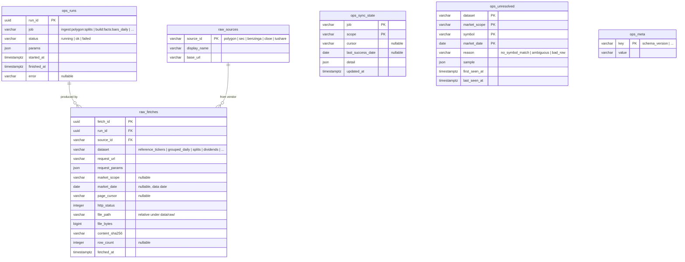
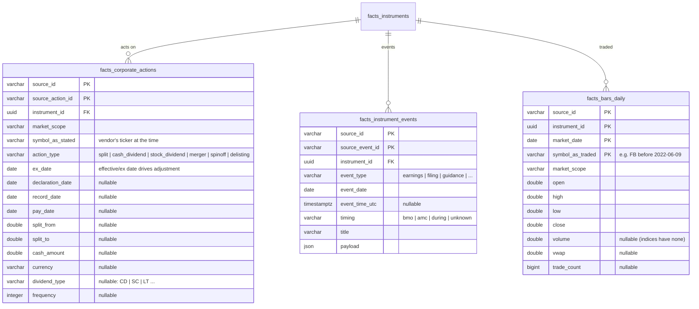
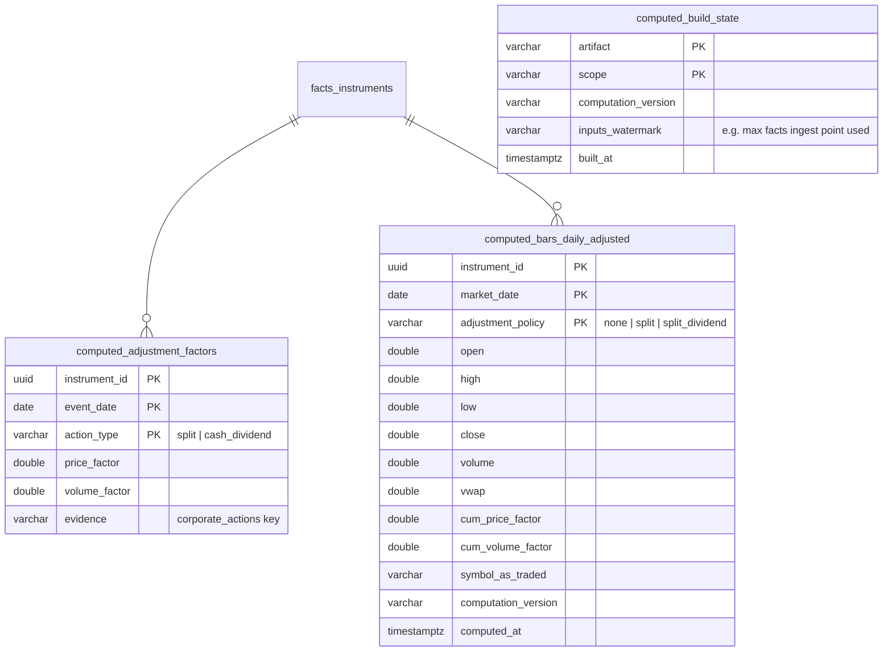

# atm3 Data Model

Status: approved 2026-07-08. Entity names below are `schema_table`; the
prefix is the DuckDB schema (`raw`, `facts`, `computed`, `ops`).

atm3 starts from scratch: no data is migrated from atm2 or any prior system.
All data enters through raw vendor ingestion, and the database file is a
disposable index over `data/raw/`.

## Layers

```mermaid
flowchart LR
  V["Vendors\nPolygon / SEC / CBOE / Tushare"] -->|fetch verbatim| RAW
  subgraph RAW["raw — untouched truth"]
    files["data/raw/&lt;source&gt;/&lt;dataset&gt;/... files"]
    catalog["raw.fetches catalog"]
    views["raw.v_* parse views (no copy)"]
    files --- catalog
    files --> views
  end
  subgraph FACTS["facts — organized facts (rebuildable from raw)"]
    identity["instruments / symbols / identifiers"]
    actions["corporate_actions / events"]
    bars["bars_daily (unadjusted)"]
    cal["exchanges / trading_days"]
  end
  subgraph COMPUTED["computed — pure functions of facts + time T (droppable cache)"]
    adj["adjustment_factors"]
    adjbars["bars_daily_adjusted (policy)"]
    metrics["metrics / universes (later)"]
  end
  views -->|deterministic builders| FACTS
  FACTS -->|named, versioned computations| COMPUTED
  OPS["ops — runs / cursors / quarantine"] -.-> RAW
  OPS -.-> FACTS
```

Layer rules:

- **raw** is append-only vendor bytes. Never edited. The only ground truth.
- **facts** are deterministic parses/organizations of raw with identity
  attached. Persisted for performance, rebuildable from raw at any time.
- **computed** is `f(facts, asOfDate, policyParams)` — pure, versioned
  functions. Tables here are caches; dropping any `computed.*` table must lose
  nothing but time.
- **ops** is bookkeeping, never market truth.

## Key concepts

### market_scope

A namespace in which a ticker string is unique at a point in time. It is an
attribute, not a storage boundary — one database holds all scopes.

| market_scope | examples | derived from |
|---|---|---|
| `us_stocks` | AAPL, SPY (stocks, ETFs, ADRs…) | Polygon `locale=us, market=stocks` |
| `us_indices` | I:SPX, I:NDX | Polygon `market=indices` |
| `cn_stocks` | 600519.SH, 000001.SZ | Tushare (later) |

US ticker uniqueness is market-wide (consolidated tape), not per-exchange, so
the scope is the market, and `exchange_mic` is a property of the listing.

### Instrument identity

An instrument is the persistent thing (Meta Platforms Inc. common stock, the
S&P 500 index, SPY the ETF). Tickers are time-ranged labels:

- `resolve(market_scope, symbol, date)` → the `facts_symbols` row whose
  `[valid_from, valid_to)` covers the date → `instrument_id`.
- Current lookup uses `valid_to is null`.
- Canonical test case: `FB` resolved to Meta until 2022-06-09, and to a
  different instrument (an ETF) later. History must never leak across.

`instrument_id` is minted deterministically from identity evidence (FIGI when
present, else first `(market_scope, symbol, first_seen)`), so a full rebuild
from raw reproduces the same ids.

### Time

- Storage timestamps are UTC (`timestamptz`). `fetched_at` = when we observed.
- `market_date` is the exchange-local trading date (the natural key of daily
  facts). Intraday uses `timestamp_utc`.
- Computed artifacts take an explicit as-of date T; "facts at time T" is a
  function call, not a mutable table.

## raw + ops

Raw payload files are not rows. Each payload file is written together with a
`<file>.meta.json` manifest carrying its fetch provenance (url, params, http
status, sha256, bytes, fetched_at, run id); `raw.fetches` is only an index
over those manifests and can be rebuilt at any time by rescanning `data/raw/`
(`npm run raw:reindex`). Per-dataset views (`raw.v_polygon_grouped_daily`,
`raw.v_polygon_reference_tickers`, …) parse the payload files in place via
`read_json`/`read_csv`/`read_parquet`.

Operational notes, verified 2026-07-08:

- Polygon aggregate rows carry both `T` (ticker) and `t` (timestamp), which
  collide in DuckDB's case-insensitive JSON struct auto-detection. Raw views
  must read `results` as `JSON[]` (`read_json(..., columns = {results:
  'JSON[]'})`) and extract fields with case-sensitive JSON operators
  (`bar->>'$.T'`).
- `ops.sync_state` dies with the database file. The only cost is that a
  completed snapshot sweep (reference tickers, splits, dividends) re-fetches
  on its next same-day rerun; per-date datasets skip via the reindexed
  `raw.fetches`.
- Ticker renames often leave the old reference row inactive **without**
  `delisted_utc` (ISDR→ACCS pattern). The identity builder ends such usages
  at the row's `last_updated_utc` date, so old tickers never stay open-ended
  and current lookups never leak into prior users.

`ops.meta` stores the `schema_version` stamp: `db/schema.sql` is declarative
and applied at every open, and a version mismatch means "delete the database
file and rebuild from raw" — there is no migration machinery.

## facts — identity and calendars

## facts — market data

Bars are stored **unadjusted, as traded, under the ticker of the day**, linked
to the instrument. `symbol_as_traded` is part of the key because one
instrument can trade as two concurrent tape lines on the same day (e.g.
when-issued tickers like AAP/AAPW); the computed layer picks the primary line
per instrument-day. Vendor-adjusted bars are never facts; when ingested (e.g.
Polygon `adjusted=true`) they are used only as parity checks for our own
adjustment computation. Rows that cannot be resolved to an instrument go to
`ops.unresolved` — never guessed, never dropped silently (in practice the
quarantine catches exchange test tickers like ZTEST/NTEST.* and
out-of-universe dividend payers like mutual funds).

Intraday bars (minute) come in a later milestone: same identity rules, stored
as partitioned parquet under `data/` with a DuckDB view, not as DB rows.

## computed — functions of facts + time T

The computed layer is primarily **code**: named, versioned pure functions in
`core/`. Persisting outputs is opportunistic caching. Initial artifacts:

Adjustment policies:

- `none` — raw as traded.
- `split` — back-adjusted for splits only.
- `split_dividend` — back-adjusted for splits and cash dividends.

When a new corporate action arrives for an instrument, its cached computed rows
are invalidated (watermark mismatch) and rebuilt. Later artifacts (technical
metrics, universes, research stores) follow the same pattern and are specified
when that phase starts.

## Source precedence

`facts.bars_daily` keeps `source_id` in the key, so two vendors can both state
facts about the same instrument-day. Computations select by an explicit
precedence rule (default: `polygon` first) — disagreement between sources is
surfaced as a data-quality signal, not silently merged.

## Initial Polygon dataset map

| raw dataset | endpoint | feeds |
|---|---|---|
| `reference_tickers` | `/v3/reference/tickers` (paged snapshot, incl. inactive) | instruments, symbols |
| `ticker_events` | `/vX/reference/tickers/{id}/events` | symbol_events |
| `splits` | `/v3/reference/splits` | corporate_actions |
| `dividends` | `/v3/reference/dividends` | corporate_actions |
| `exchanges` | `/v3/reference/exchanges` | exchanges |
| `market_holidays` | `/v1/marketstatus/upcoming` | trading_days |
| `grouped_daily` | `/v2/aggs/grouped/.../{date}` `adjusted=false` | bars_daily (us_stocks) |
| `grouped_daily_adjusted` | same, `adjusted=true` | parity checks only |
| `index_aggs` | `/v2/aggs/ticker/I:*/range/1/day/...` | deferred — SPY is the market proxy for now |
| `earnings` | Benzinga via Polygon (later) | instrument_events |
