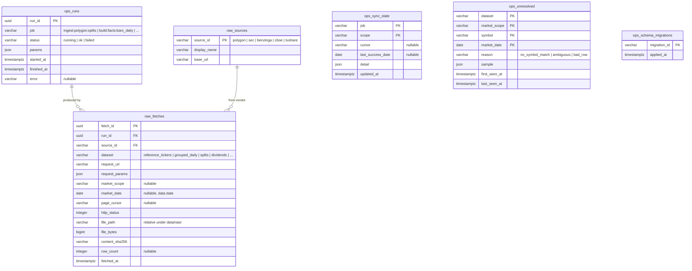
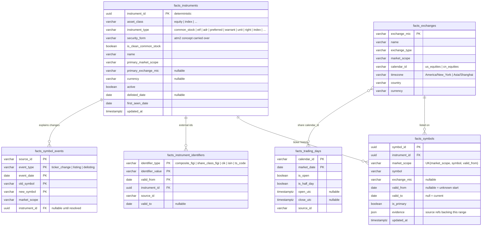
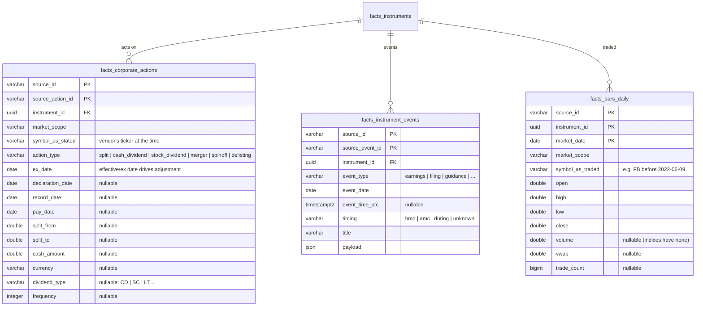
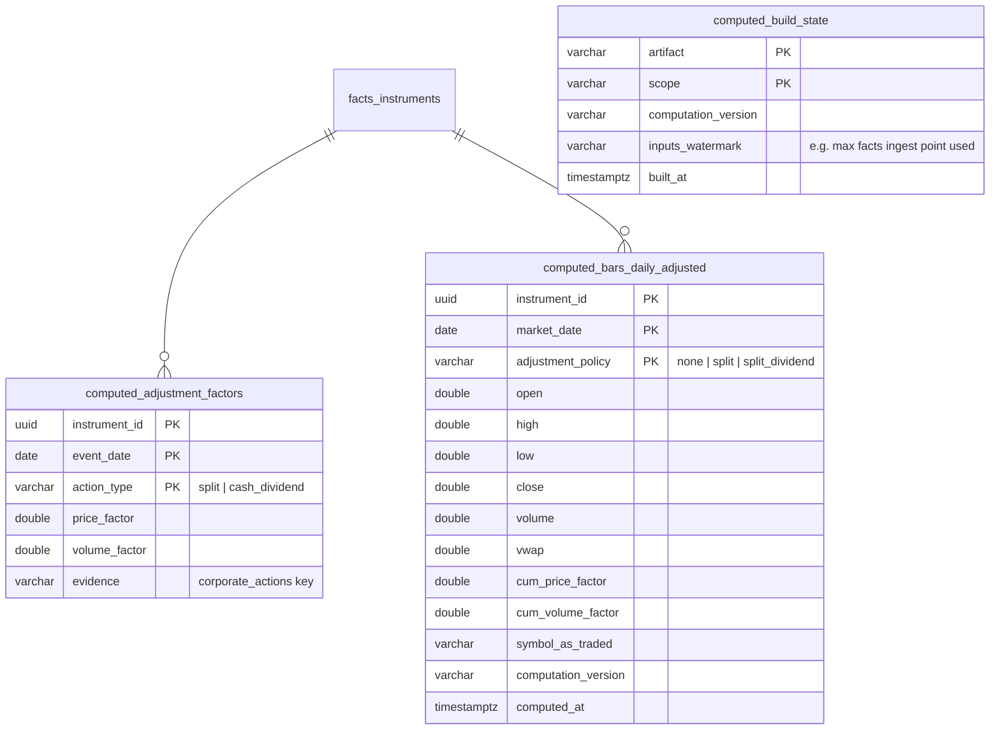

# atm3 Data Model

Status: proposed 2026-07-08, needs owner sign-off. Entity names below are
`schema_table`; the prefix is the DuckDB schema (`raw`, `facts`, `computed`,
`ops`).

## Layers

```mermaid
flowchart LR
  V["Vendors\nPolygon / SEC / CBOE / Tushare"] -->|fetch verbatim| RAW
  subgraph RAW["raw — untouched truth"]
    files["data/raw/&lt;source&gt;/&lt;dataset&gt;/... files"]
    catalog["raw.fetches catalog"]
    views["raw.v_* parse views (no copy)"]
    files --- catalog
    files --> views
  end
  subgraph FACTS["facts — organized facts (rebuildable from raw)"]
    identity["instruments / symbols / identifiers"]
    actions["corporate_actions / events"]
    bars["bars_daily (unadjusted)"]
    cal["exchanges / trading_days"]
  end
  subgraph COMPUTED["computed — pure functions of facts + time T (droppable cache)"]
    adj["adjustment_factors"]
    adjbars["bars_daily_adjusted (policy)"]
    metrics["metrics / universes (later)"]
  end
  views -->|deterministic builders| FACTS
  FACTS -->|named, versioned computations| COMPUTED
  OPS["ops — runs / cursors / quarantine"] -.-> RAW
  OPS -.-> FACTS
```

Layer rules:

- **raw** is append-only vendor bytes. Never edited. The only ground truth.
- **facts** are deterministic parses/organizations of raw with identity
  attached. Persisted for performance, rebuildable from raw at any time.
- **computed** is `f(facts, asOfDate, policyParams)` — pure, versioned
  functions. Tables here are caches; dropping any `computed.*` table must lose
  nothing but time.
- **ops** is bookkeeping, never market truth.

## Key concepts

### market_scope

A namespace in which a ticker string is unique at a point in time. It is an
attribute, not a storage boundary — one database holds all scopes.

| market_scope | examples | derived from |
|---|---|---|
| `us_stocks` | AAPL, SPY (stocks, ETFs, ADRs…) | Polygon `locale=us, market=stocks` |
| `us_indices` | I:SPX, I:NDX | Polygon `market=indices` |
| `cn_stocks` | 600519.SH, 000001.SZ | Tushare (later) |

US ticker uniqueness is market-wide (consolidated tape), not per-exchange, so
the scope is the market, and `exchange_mic` is a property of the listing.

### Instrument identity

An instrument is the persistent thing (Meta Platforms Inc. common stock, the
S&P 500 index, SPY the ETF). Tickers are time-ranged labels:

- `resolve(market_scope, symbol, date)` → the `facts_symbols` row whose
  `[valid_from, valid_to)` covers the date → `instrument_id`.
- Current lookup uses `valid_to is null`.
- Canonical test case: `FB` resolved to Meta until 2022-06-09, and to a
  different instrument (an ETF) later. History must never leak across.

`instrument_id` is minted deterministically from identity evidence (FIGI when
present, else first `(market_scope, symbol, first_seen)`), so a full rebuild
from raw reproduces the same ids.

### Time

- Storage timestamps are UTC (`timestamptz`). `fetched_at` = when we observed.
- `market_date` is the exchange-local trading date (the natural key of daily
  facts). Intraday uses `timestamp_utc`.
- Computed artifacts take an explicit as-of date T; "facts at time T" is a
  function call, not a mutable table.

## raw + ops

Raw payload files are not rows — `raw.fetches` catalogs them. Per-dataset views
(`raw.v_polygon_grouped_daily`, `raw.v_polygon_reference_tickers`, …) parse the
files in place via `read_json`/`read_csv`/`read_parquet`.

## facts — identity and calendars

## facts — market data

Bars are stored **unadjusted, as traded, under the ticker of the day**, linked
to the instrument. Vendor-adjusted bars are never facts; when ingested (e.g.
Polygon `adjusted=true`) they are used only as parity checks for our own
adjustment computation. Rows that cannot be resolved to an instrument go to
`ops.unresolved` — never guessed, never dropped silently.

Intraday bars (minute) come in a later milestone: same identity rules, stored
as partitioned parquet under `data/` with a DuckDB view, not as DB rows.

## computed — functions of facts + time T

The computed layer is primarily **code**: named, versioned pure functions in
`core/`. Persisting outputs is opportunistic caching. Initial artifacts:

Adjustment policies:

- `none` — raw as traded.
- `split` — back-adjusted for splits only.
- `split_dividend` — back-adjusted for splits and cash dividends
  (atm2's `split_dividend_back_adjusted`).

When a new corporate action arrives for an instrument, its cached computed rows
are invalidated (watermark mismatch) and rebuilt. Later artifacts (technical
metrics, universes, research stores) follow the same pattern and are specified
when that phase starts — atm2's wide metric tables are explicitly **not**
copied now.

## Source precedence

`facts.bars_daily` keeps `source_id` in the key, so two vendors can both state
facts about the same instrument-day. Computations select by an explicit
precedence rule (default: `polygon` first) — disagreement between sources is
surfaced as a data-quality signal, not silently merged.

## Mapping from atm2

| atm2 (`app.*`) | atm3 |
|---|---|
| per-market DB files | one DB; `market_scope` column |
| `data_sources` | `raw.sources` |
| `source_symbols` (parsed rows + raw_source JSON) | raw files + `raw.v_polygon_reference_tickers` view |
| `instruments`, `symbols`, `instrument_identifiers`, `symbol_events` | `facts.*` same concepts, symbols scoped by `market_scope` |
| `corporate_actions` | `facts.corporate_actions` (+ merger/spinoff/delisting types) |
| `price_adjustment_events` | `computed.adjustment_factors` |
| `instrument_events` | `facts.instrument_events` |
| `ohlcv_bars` (raw rows in DB) | raw files + `facts.bars_daily` |
| `normalized_ohlcv_bars`, `research_daily_bars` | `computed.bars_daily_adjusted` |
| `market_trading_days` (global, per-market DB) | `facts.trading_days` keyed by `calendar_id` |
| `market_data_files` | `raw.fetches` |
| `ingestion_runs`, `event_ingestion_state`, `computation_state` | `ops.runs`, `ops.sync_state`, `computed.build_state` |
| research/backtest/trading tables | out of scope; redesigned in a later phase |

## Initial Polygon dataset map

| raw dataset | endpoint | feeds |
|---|---|---|
| `reference_tickers` | `/v3/reference/tickers` (paged snapshot, incl. inactive) | instruments, symbols |
| `ticker_events` | `/vX/reference/tickers/{id}/events` | symbol_events |
| `splits` | `/v3/reference/splits` | corporate_actions |
| `dividends` | `/v3/reference/dividends` | corporate_actions |
| `exchanges` | `/v3/reference/exchanges` | exchanges |
| `market_holidays` | `/v1/marketstatus/upcoming` | trading_days |
| `grouped_daily` | `/v2/aggs/grouped/.../{date}` `adjusted=false` | bars_daily (us_stocks) |
| `grouped_daily_adjusted` | same, `adjusted=true` | parity checks only |
| `index_aggs` | `/v2/aggs/ticker/I:*/range/1/day/...` | bars_daily (us_indices) |
| `earnings` | Benzinga via Polygon (later) | instrument_events |
