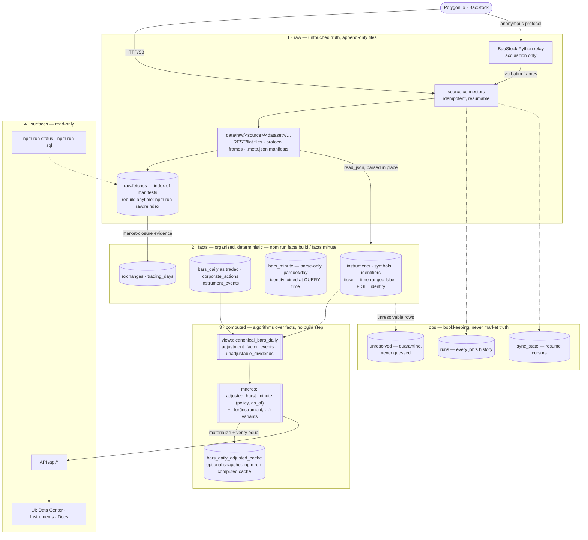
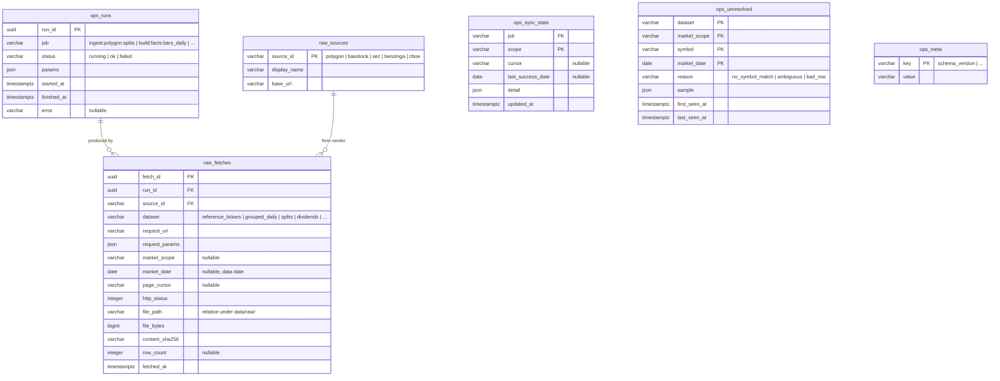
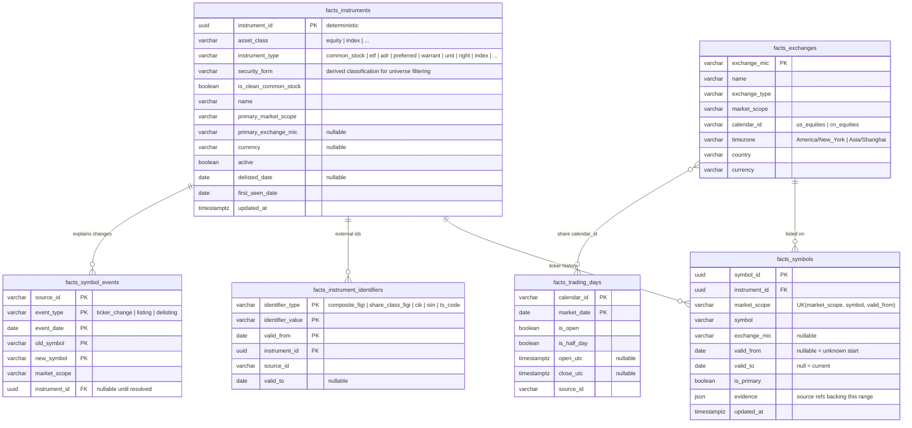
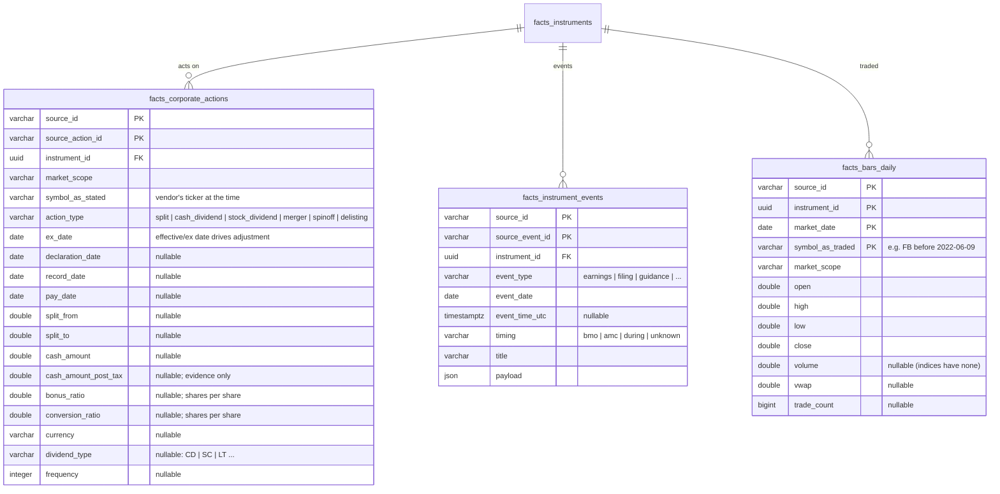
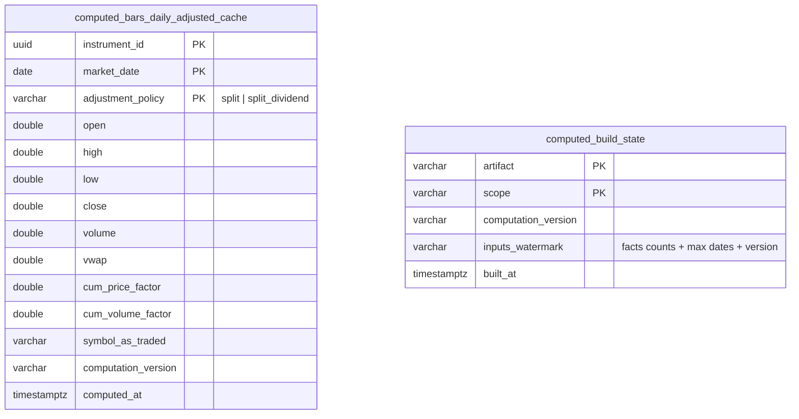

# atm3 Data Model

Status: approved 2026-07-08. Entity names below are `schema_table`; the
prefix is the DuckDB schema (`raw`, `facts`, `computed`, `ops`).

atm3 starts from scratch: no data is migrated from atm2 or any prior system.
All data enters through raw vendor ingestion, and the database file is a
disposable index over `data/raw/`.

## The pipeline, end to end

Reading the shapes: **cylinders** are database tables, **double-bordered
boxes** are functions (views/table macros), plain boxes are code/surfaces,
**dashed lines** are bookkeeping. Everything left of the surfaces is
reproducible: delete the database file and steps 1–3 rebuild it from the
files on disk.

Layer rules:

- **raw** is append-only vendor bytes. Never edited. The only ground truth.
- **facts** are deterministic parses/organizations of raw with identity
  attached. Persisted for performance, rebuildable from raw at any time.
- **computed** is `f(facts, asOfDate, policyParams)` — pure, versioned
  functions. Tables here are caches; dropping any `computed.*` table must lose
  nothing but time.
- **ops** is bookkeeping, never market truth.

## Key concepts

### market_scope

A namespace in which a ticker string is unique at a point in time. It is an
attribute, not a storage boundary — one database holds all scopes.

| market_scope | examples | derived from |
|---|---|---|
| `us_stocks` | AAPL, SPY (stocks, ETFs, ADRs…) | Polygon `locale=us, market=stocks` |
| `us_indices` | I:SPX, I:NDX | Polygon `market=indices` |
| `cn_stocks` | 600519, 000001 | BaoStock prototype; connector replaceable |

US ticker uniqueness is market-wide (consolidated tape), not per-exchange, so
the scope is the market, and `exchange_mic` is a property of the listing.

### Instrument identity

An instrument is the persistent thing (Meta Platforms Inc. common stock, the
S&P 500 index, SPY the ETF). Tickers are time-ranged labels:

- `resolve(market_scope, symbol, date)` → the `facts_symbols` row whose
  `[valid_from, valid_to)` covers the date → `instrument_id`.
- Current lookup uses `valid_to is null`.
- Canonical test case: `FB` resolved to Meta until 2022-06-09, and to a
  different instrument (an ETF) later. History must never leak across.

`instrument_id` is minted deterministically from identity evidence (FIGI when
present, else first `(market_scope, symbol, first_seen)`), so a full rebuild
from raw reproduces the same ids.

### Time

- Storage timestamps are UTC (`timestamptz`). `fetched_at` = when we observed.
- `market_date` is the exchange-local trading date (the natural key of daily
  facts). Intraday uses `timestamp_utc`.
- Computed artifacts take an explicit as-of date T; "facts at time T" is a
  function call, not a mutable table.

## raw + ops

Raw payload files are not rows. Each payload file is written together with a
`<file>.meta.json` manifest carrying its fetch provenance (url, params, http
status, sha256, bytes, fetched_at, run id); `raw.fetches` is only an index
over those manifests and can be rebuilt at any time by rescanning `data/raw/`
(`npm run raw:reindex`). Per-dataset views (`raw.v_polygon_grouped_daily`,
`raw.v_polygon_reference_tickers`, …) parse the payload files in place via
`read_json`/`read_csv`/`read_parquet`.

Operational notes, verified 2026-07-08:

- Polygon aggregate rows carry both `T` (ticker) and `t` (timestamp), which
  collide in DuckDB's case-insensitive JSON struct auto-detection. Raw views
  must read `results` as `JSON[]` (`read_json(..., columns = {results:
  'JSON[]'})`) and extract fields with case-sensitive JSON operators
  (`bar->>'$.T'`).
- `ops.sync_state` dies with the database file. The only cost is that a
  completed snapshot sweep (reference tickers, splits, dividends) re-fetches
  on its next same-day rerun; per-date datasets skip via the reindexed
  `raw.fetches`.
- Ticker renames often leave the old reference row inactive **without**
  `delisted_utc` (ISDR→ACCS pattern). The identity builder ends such usages
  at the row's `last_updated_utc` date, so old tickers never stay open-ended
  and current lookups never leak into prior users.
- Vendors state one corporate action under BOTH tickers around a rename
  (MULN/BINI 2025-06-02 split). The factor computation collapses duplicate
  same-day statements to one factor — never a product of statements.
- Vendors publish actions before they execute (SOXS 10:1 with a future ex
  date) and after an instrument stops trading (FOXO 3000:1 after going
  dark). An adjustment event applies only where the series has bars after
  it: each series anchors to its own latest tape. A post-final-bar action is
  a uniform factor across the whole series — zero effect on returns.
- Ticker case is significant in vendor notation (`INNpF` is a preferred;
  `INNPF` is a different OTC security). Symbols are never case-folded,
  anywhere.
- Polygon dividend rows ship a CUMULATIVE `historical_adjustment_factor`;
  it is never ingested. Per-event factors come from cash amounts and our own
  raw closes, with same-day distinct distributions summed first.
- Cached adjusted-bar policies are `split` and `split_dividend`; policy
  `none` IS `facts.bars_daily` and is never duplicated.

`ops.meta` stores the `schema_version` stamp: `db/schema.sql` is declarative
and applied at every open, and a version mismatch means "delete the database
file and rebuild from raw" — there is no migration machinery.

## facts — identity and calendars

## facts — market data

Coverage contract: the daily window starts fixed at 2024-07-01
(`ATM3_BACKFILL_FROM`, pinned) and grows through yesterday; every trading
day must have raw grouped evidence and market-wide bars, closures are
zero-row evidence, and `verify:continuity` (CLI + pipeline card) asserts it
— raw holes self-heal on the next replenish. The contract is market-level:
an individual instrument missing a day (halt, no trades) is a market fact,
not a data hole.

Bars are stored **unadjusted, as traded, under the ticker of the day**, linked
to the instrument. `symbol_as_traded` is part of the key because one
instrument can trade as two concurrent tape lines on the same day (e.g.
when-issued tickers like AAP/AAPW); the computed layer picks the primary line
per instrument-day. Vendor-adjusted bars are never facts; when ingested (e.g.
Polygon `adjusted=true`) they are used only as parity checks for our own
adjustment computation. Rows that cannot be resolved to an instrument go to
`ops.unresolved` — never guessed, never dropped silently (in practice the
quarantine catches exchange test tickers like ZTEST/NTEST.* and
out-of-universe dividend payers like mutual funds).

## facts — minute bars (intraday)

Raw truth is the vendor's flat file: one csv.gz per trading day covering the
whole market's minute aggregates (04:00–20:00 ET), landed **byte-identical**
under `raw/polygon/minute_aggs/date=…/` (~30 MB/day; the manifest hashes the
artifact exactly as received — `storeVerbatim`).

Facts materialize a **parse-only parquet** per day under
`<ATM3_DATA_DIR>/facts/bars_minute/date=…/`: typed columns and nothing else
(market_date, symbol, window_start_utc, OHLC, volume, transactions —
epoch-nanosecond timestamps floor-divided as integers so minute boundaries
stay exact). Each day is row-count-verified against its raw file before
acceptance, and is rebuildable from raw at any time. Files under `facts/`
are derived, unlike `raw/`.

Identity is attached at QUERY time, never baked into files:

| function | kind | computes |
|---|---|---|
| `facts.bars_minute_parsed` | view | the parquet glob, parse only |
| `facts.bars_minute` | view | + `instrument_id` via symbol validity at `market_date` |
| `facts.bars_minute_unresolved` | view | quarantine: minute rows resolving to no instrument |
| `computed.adjusted_bars_minute(policy, as_of := null)` | table macro | adjusted minutes — day-grained factors, same anchor rule |
| `computed.adjusted_bars_minute_for(instrument, policy, as_of := null)` | table macro | single-instrument variant |

Because identity is a query-time join, symbol-history refinements
retroactively apply to ALL minute history with zero rebuilds. A zero-row
`_sentinel` parquet is auto-created at database open so the views always
bind, even before any minute data exists.

Cross-source doctrine (learned 2026-07-09 via `npm run verify:intraday`):
**daily bars are authoritative for official OHLC; minute bars are
authoritative for intraday paths.** Intraday aggregation excludes
condition-coded prints, so `sum(minute volume) <= daily volume` is a hard
invariant (zero violations across 35,642 instrument-days); the closing
auction prints as the OPEN of the 16:00 ET minute where an auction exists;
micro-caps' official closes are often absent from the minute tape entirely.
The verify script enforces the invariant and monitors segmented
close-agreement baselines for drift.

## computed — algorithms over facts

The computed layer is **functions, not data**. Adjusted bars are a view of
the facts at a point in time T: a newly arrived corporate action
retroactively changes every historical adjusted bar, so no stored copy is
ever a fact, and pre-storing "every T's view" is a category error. The
organizing principle: **100 functions on one data beats 10 functions on
10 data.**

The algorithm surface, defined declaratively in `db/schema.sql`:

| function | kind | computes |
|---|---|---|
| `computed.canonical_bars_daily` | view | one tape line per instrument-day (max volume) |
| `computed.dividend_cash_by_exdate` | view | same-instrument-currency statements; same-day distinct distributions summed |
| `computed.adjustment_factor_events` | view | per-event split/cash/stock-distribution factors from facts + own raw closes |
| `computed.unadjustable_dividends` | view | dividends yielding no factor, with reason |
| `computed.adjusted_bars(policy, as_of := null)` | table macro | THE adjusted series: any policy (`none` / `split` / `split_dividend`), any as-of date T, on demand |
| `computed.adjusted_bars_for(instrument, policy, as_of := null)` | table macro | single-instrument variant (filters inside every stage) |

Adjustment semantics (encoded in those views; formulas mirrored in
`core/adjustments.ts`): splits scale price by from/to and volume by to/from;
bonus/conversion distributions with total ratio b scale price by 1/(1+b) and
volume by 1+b; cash distributions in the instrument's currency scale price by
1 − cash/prev-raw-close, with same-day distinct distributions summed first. An
event applies only where the (as-of-limited) series has bars after it — each
series anchors to its own latest tape.

Exactly one cache table exists, plus its freshness ledger:

`bars_daily_adjusted_cache` is a materialized snapshot of
`computed.adjusted_bars(policy)` at the current T — refreshed by
`npm run computed:cache`, guarded by the `computed.build_state` watermark,
tested identical to the macro, and always droppable. Consumers call the
macros, or check freshness before reading the cache; the cache is never the
source of truth.

Why the cache exists (measured 2026-07-08): the full-market macro costs
~78s over 5.65M bars, and `adjusted_bars_for` serves one instrument in
~0.7s. Whole-market research scans read the fresh cache; everything else
computes on the fly. Later artifacts (metrics, universes) follow the same
pattern: algorithm first, cache only when profiling demands it.

## View at T

The first research surface is a compute-only view of one instrument at an
exchange-local market date T. `GET /api/instruments/:id/view-at?t=YYYY-MM-DD`
returns the exact catalog in `core/metrics-catalog.ts`; the Instruments page
sets T from a date input or chart click. No result is stored.

The backward half is end-of-day knowledge at T:

- Bars are limited to `market_date <= T` and adjusted with
  `computed.adjusted_bars_for(..., as_of := T)`.
- Effective corporate actions require `ex_date <= T`; a future ex date is
  visible only when its `declaration_date <= T`.
- Every metric reports `bars_available`. A short window or guarded
  denominator returns a null value with a reason, never a shortened formula.
- The catalog contains 53 ids: 40 instrument metrics and 13 context metrics.
  The approved plan's prose said 47, but its exact tables enumerate 53; all
  named rows are retained.

US context compares trailing aligned log returns with SPY and with the
highest-correlation member of the 19-symbol ETF config. Betas, correlations,
residual returns, relative returns, and idiosyncratic volatility use only
bars through T. CN returns the same 13 rows with
`reason: no_market_baseline`, preserving one source-neutral response shape.
The curated ETF labels are current survivors; while their price windows and
selection are as-of-T honest, config membership is not a historical-universe
claim.

Forward returns are a separate, opt-in hindsight block. Horizons are 1, 5,
21, 63, 126, and 252 scope-calendar open days strictly after T, entered at
the next instrument open by default (`t_close` is also supported). Returns,
MAE, and MFE incorporate splits and cash dividends; missing entry bars,
suspensions, and terminal tape ends remain explicit through reason, stale,
and delisted fields. This future data never enters backward metrics or
baseline selection.

`npm run verify:view-at` checks AAPL and 600519 against the catalog and prints
a compact live sample. Stop the development server first because the script
opens DuckDB read-only. Fixture tests enforce the stronger law: landing raw
data after T and rebuilding facts cannot change the backward response at T.

## Source precedence

`facts.bars_daily` keeps `source_id` in the key, so two vendors can both state
facts about the same instrument-day. Computations select by an explicit
precedence rule (default: `polygon` first) — disagreement between sources is
surfaced as a data-quality signal, not silently merged.

## Initial Polygon dataset map

| raw dataset | endpoint | feeds |
|---|---|---|
| `reference_tickers` | `/v3/reference/tickers` (paged snapshot, incl. inactive) | instruments, symbols |
| `ticker_events` | `/vX/reference/tickers/{id}/events` | symbol_events |
| `splits` | `/v3/reference/splits` | corporate_actions |
| `dividends` | `/v3/reference/dividends` | corporate_actions |
| `exchanges` | `/v3/reference/exchanges` | exchanges |
| `market_holidays` | `/v1/marketstatus/upcoming` | trading_days |
| `grouped_daily` | `/v2/aggs/grouped/.../{date}` `adjusted=false` | bars_daily (us_stocks) |
| `grouped_daily_adjusted` | same, `adjusted=true` | parity checks only |
| `index_aggs` | `/v2/aggs/ticker/I:*/range/1/day/...` | deferred — SPY is the market proxy for now |
| `earnings` | Benzinga via Polygon (later) | instrument_events |

## BaoStock CN prototype dataset map

BaoStock is an anonymous, no-SLA prototype source. A pinned Python relay is
acquisition-only and emits decompressed application protocol frames; TypeScript
lands each frame byte-for-byte with a `.frame` extension and manifest. The
42-code universe is intentionally selected to exercise market structure and is
not a statistically representative research universe.

| raw dataset | BaoStock call | facts use |
|---|---|---|
| `trade_cal` | `query_trade_dates` | `cn_equities` trading days |
| `universe` | `query_all_stock` | listing/name snapshot evidence |
| `stock_basic` | `query_stock_basic` | instruments, symbols, identifiers |
| `daily_k` | `query_history_k_data_plus`, `adjustflag=3` | unadjusted daily bars |
| `dividend` | `query_dividend_data`, `yearType=operate` | cash and stock distributions |
| `adj_factor` | `query_adjust_factor` | diagnostic comparison only |

Both XSHG and XSHE point to the shared `cn_equities` calendar. The source
calendar is canonical only after the facts builder checks it against observed
universe/trading-status evidence; disagreement is quarantined.
